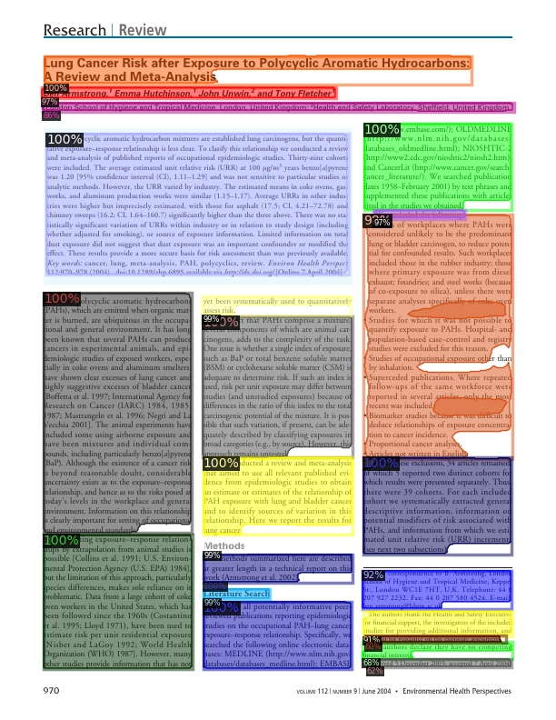
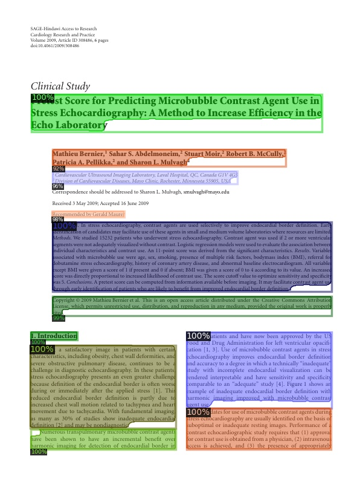

---

# This repo contains the training configuration, code and trained model for [PubLayNet](https://github.com/ibm-aur-nlp/PubLayNet) dataset  

Important:
* Models are trained on a portion of the dataset (train-0.zip, train-1.zip, train-2.zip, train-3.zip)
* Trained on total 191832 images
* Models are evaluated on dev.zip
* Trained using Nvidia GTX 1080Ti 11GB

## Mask-RCNN resnext101_32x8d backbone
Config file: ./configs/DLA_mask_rcnn_X_101_32x8d_FPN_3x.yaml  
Trained model: https://www.dropbox.com/sh/jxuxu2oh4f8ogms/AADaG0U2hXORh_kd8NazDAgsa?dl=0

 

## Mask-RCNN resnet101 backbone  
Config file: ./configs/DLA_mask_rcnn_R_101_FPN_3x.yaml  
Trained model: https://www.dropbox.com/sh/jxuxu2oh4f8ogms/AADaG0U2hXORh_kd8NazDAgsa?dl=0

---

## Sample results from detectron2

  

  

 

---

## License

Detectron2 is released under the [Apache 2.0 license](LICENSE).

## Citing Detectron

@misc{wu2019detectron2,
  author =       {Yuxin Wu and Alexander Kirillov and Francisco Massa and
                  Wan-Yen Lo and Ross Girshick},
  title =        {Detectron2},
  howpublished = {\url{https://github.com/facebookresearch/detectron2}},
  year =         {2019}
}

