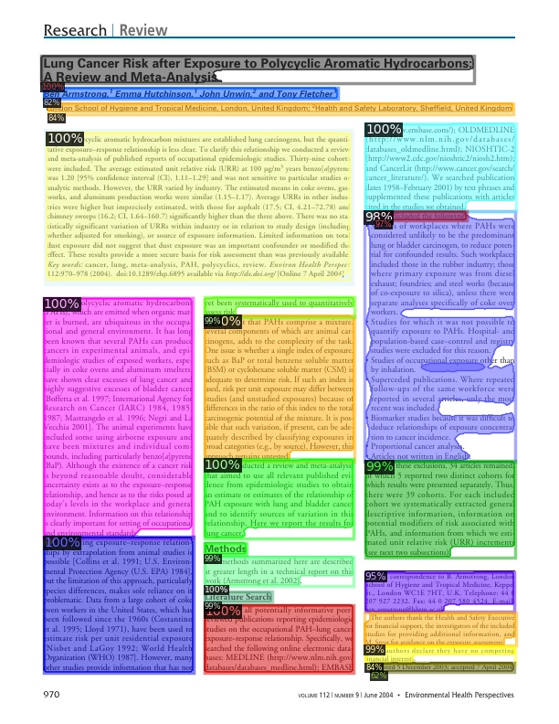
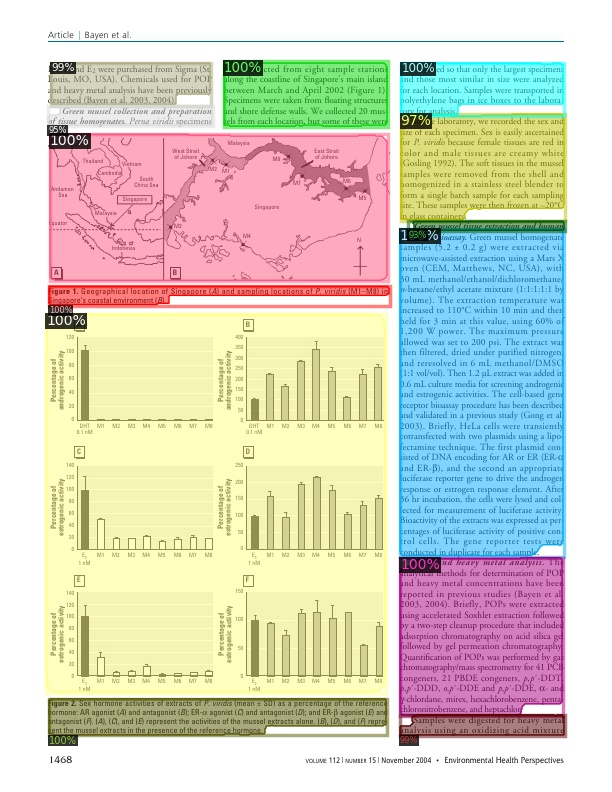
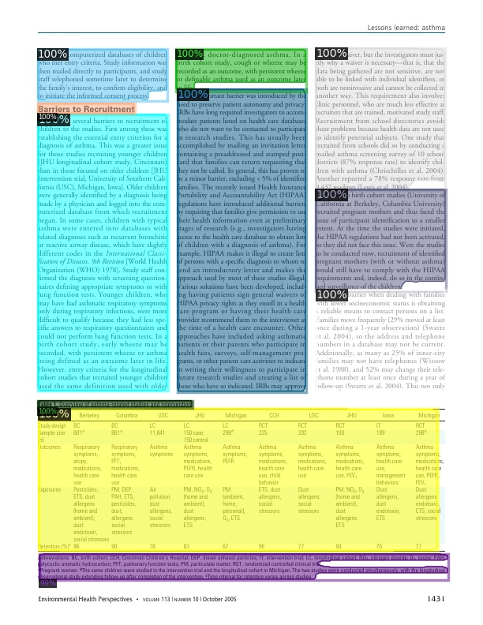
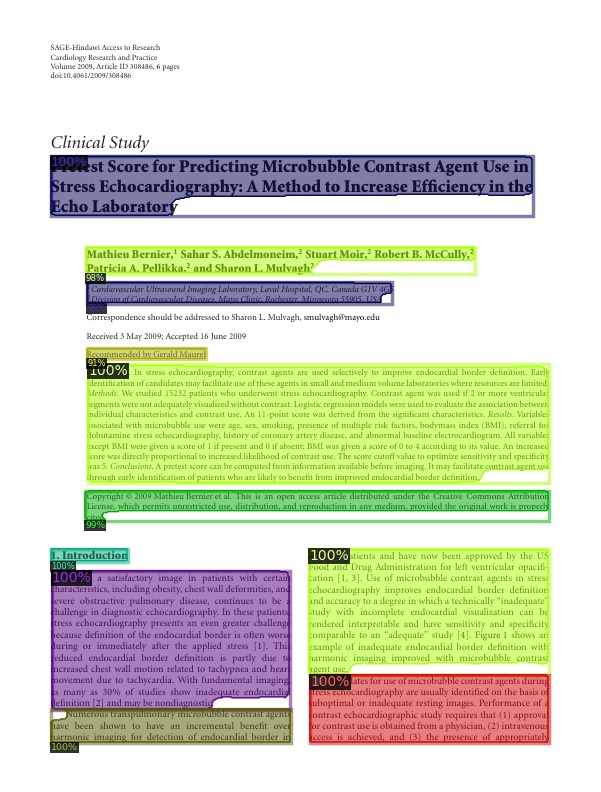

---

## Detectron2 trained on [PubLayNet](https://github.com/ibm-aur-nlp/PubLayNet) dataset

This repo contains the training configurations, code and trained models trained on [PubLayNet](https://github.com/ibm-aur-nlp/PubLayNet) dataset  using [Detectron2](https://github.com/facebookresearch/detectron2) implementation.  
[PubLayNet](https://github.com/ibm-aur-nlp/PubLayNet) is a very large dataset for document layout analysis (document segmentation). It can be used to trained semantic segmentation/Object detection models.

NOTE  
* Models are trained on a portion of the dataset (train-0.zip, train-1.zip, train-2.zip, train-3.zip)
* Trained on total 191,832 images
* Models are evaluated on dev.zip (~11,000 images)
* Backbone pretrained on COCO dataset is used but trained from scratch on PubLayNet dataset
* Trained using Nvidia GTX 1080Ti 11GB
* Trained on Windows 10


## Benchmarking  

| Architecture                                                                                                  | No. images | AP     | AP50   | AP75   | AP Small | AP Medium | AP Large | Model size full | Model size trimmed |
|---------------------------------------------------------------------------------------------------------------|------------|--------|--------|--------|----------|-----------|----------|--------------------|-----------------|
| [MaskRCNN Resnext101_32x8d FPN 3X](https://www.dropbox.com/sh/1098ym6vhad4zi6/AABe16eSdY_34KGp52W0ruwha?dl=0) | 191,832    | 90.574 | 97.704 | 95.555 | 39.904   | 76.350    | 95.165   | 816M               | 410M            |
| [MaskRCNN Resnet101 FPN 3X](https://www.dropbox.com/sh/wgt9skz67usliei/AAD9n6qbsyMz1Y3CwpZpHXCpa?dl=0)        | 191,832    | 90.335 | 96.900 | 94.609 | 36.588   | 73.672    | 94.533   |480M                    | 240M            |
|                                                                                                               |            |        |        |        |          |           |          |                    |                 |


## Configuration used for training   

| Architecture                                                                                                  | Config file                                   | Training Script          |
|---------------------------------------------------------------------------------------------------------------|-----------------------------------------------|--------------------------|
| [MaskRCNN Resnext101_32x8d FPN 3X](https://www.dropbox.com/sh/1098ym6vhad4zi6/AABe16eSdY_34KGp52W0ruwha?dl=0) | configs/DLA_mask_rcnn_X_101_32x8d_FPN_3x.yaml | ./tools/train_net_dla.py |
| [MaskRCNN Resnet101 FPN 3X](https://www.dropbox.com/sh/wgt9skz67usliei/AAD9n6qbsyMz1Y3CwpZpHXCpa?dl=0)        | configs/DLA_mask_rcnn_R_101_FPN_3x.yaml       | ./tools/train_net_dla.py |


## Some helper code and cli commands  

Add the below code in demo/demo.py to get confidence along with label names
```
from detectron2.data import MetadataCatalog
MetadataCatalog.get("dla_val").thing_classes = ['text', 'title', 'list', 'table', 'figure']
```

Then run below command for prediction on single image
```
python demo/demo.py --config-file configs/DLA_mask_rcnn_X_101_32x8d_FPN_3x.yaml --input "<path to image.jpg>" --output <path to save the predicted image> --confidence-threshold 0.5 --opts MODEL.WEIGHTS <path to model_final_trimmed.pth> MODEL.DEVICE cpu
```

### TODOs ⏰

- [ ] Train MaskRCNN resnet50  


---

## Sample results from detectron2

|  |  |
|---------------------------------------------------------------------------|---------------------------------------------------------------------------|
|  |  |
|  |  |
|  |  |
|  |                                                                           |

--- 


Detectron2 is Facebook AI Research's next generation software system
that implements state-of-the-art object detection algorithms.
It is a ground-up rewrite of the previous version,
[Detectron](https://github.com/facebookresearch/Detectron/),
and it originates from [maskrcnn-benchmark](https://github.com/facebookresearch/maskrcnn-benchmark/).

<div align="center">
  
</div>

### What's New
* It is powered by the [PyTorch](https://pytorch.org) deep learning framework.
* Includes more features such as panoptic segmentation, densepose, Cascade R-CNN, rotated bounding boxes, etc.
* Can be used as a library to support [different projects](projects/) on top of it.
  We'll open source more research projects in this way.
* It [trains much faster](https://detectron2.readthedocs.io/notes/benchmarks.html).

See our [blog post](https://ai.facebook.com/blog/-detectron2-a-pytorch-based-modular-object-detection-library-/)
to see more demos and learn about detectron2.

## Installation

See [INSTALL.md](INSTALL.md).

## Quick Start

See [GETTING_STARTED.md](GETTING_STARTED.md),
or the [Colab Notebook](https://colab.research.google.com/drive/16jcaJoc6bCFAQ96jDe2HwtXj7BMD_-m5).

Learn more at our [documentation](https://detectron2.readthedocs.org).
And see [projects/](projects/) for some projects that are built on top of detectron2.

## Model Zoo and Baselines

We provide a large set of baseline results and trained models available for download in the [Detectron2 Model Zoo](MODEL_ZOO.md).


## License

Detectron2 is released under the [Apache 2.0 license](LICENSE).

## Citing Detectron

If you use Detectron2 in your research or wish to refer to the baseline results published in the [Model Zoo](MODEL_ZOO.md), please use the following BibTeX entry.

```BibTeX
@misc{wu2019detectron2,
  author =       {Yuxin Wu and Alexander Kirillov and Francisco Massa and
                  Wan-Yen Lo and Ross Girshick},
  title =        {Detectron2},
  howpublished = {\url{https://github.com/facebookresearch/detectron2}},
  year =         {2019}
}
```
