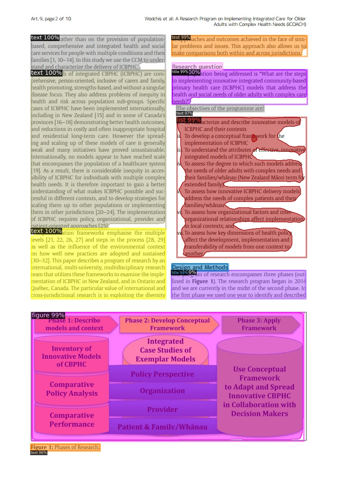

Detectron2 simple demo
====

You can use detectron2 more easily and you can get the output image and jsonfile stores the size of the input image and the information of the detected boxes by storing model in the model directory and using the following command in the detectron2_demo directory.
```
python demo/main.py -i <input file path> -o <output file path>
```
---

## Sample results from detectron2


* detected output image

|  |  |
|---------------------------------------------------------------------------|---------------------------------------------------------------------------|

* output jsonfile


---

## explanation of json keys


   * inputImgShape  : size of input image (height, width)
   * detectedBoxes  : information of detected boxes
     * category  : category of detected box
     * detectedBoxArea  : (x1, y1, x2, y2)
     * overallRatioOfDetectedBox  : (x1/inputImgShape's width, y1/inputImgShape's height ,x2/inputImgShape's width , y2/inputImgShape's height)
     * confidenceScore  : conficence score of detected box

---
## Benchmarking  
set one of these models in the model directory

 | Architecture                                                                                                  | No. images | AP     | AP50   | AP75   | AP Small | AP Medium | AP Large | Model size full | Model size trimmed |
 |---------------------------------------------------------------------------------------------------------------|------------|--------|--------|--------|----------|-----------|----------|--------------------|-----------------|
 | [MaskRCNN Resnext101_32x8d FPN 3X](https://www.dropbox.com/sh/1098ym6vhad4zi6/AABe16eSdY_34KGp52W0ruwha?dl=0) | 191,832    | 90.574 | 97.704 | 95.555 | 39.904   | 76.350    | 95.165   | 816M               | 410M            |
 | [MaskRCNN Resnet101 FPN 3X](https://www.dropbox.com/sh/wgt9skz67usliei/AAD9n6qbsyMz1Y3CwpZpHXCpa?dl=0)        | 191,832    | 90.335 | 96.900 | 94.609 | 36.588   | 73.672    | 94.533   |480M                    | 240M            |
 | [MaskRCNN Resnet50 FPN 3X](https://www.dropbox.com/sh/44ez171b2qaocd2/AAB0huidzzOXeo99QdplZRjua?dl=0)                                                                                                              | 191,832           | 87.219       | 96.949       | 94.385       | 38.164         | 72.292          |  94.081        |                    |  168M               |

---

## Requirement
   see [pyproject.toml](pyproject.toml).

## Licence

Detectron2 is released under the [Apache 2.0 license](LICENSE).
